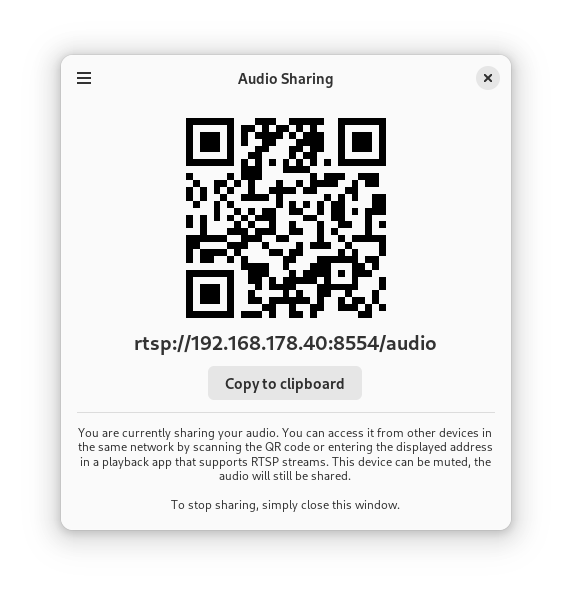

# Audio Sharing



Running Audio Sharing will automatically share the current audio playback in the form of an RTSP stream. This stream can then be played back by other devices, for example using VLC. 

## Getting in Touch
If you have any questions regarding the use or development of Audio Sharing,
want to discuss design or simply hang out, please join us on our [#audio-sharing:gnome.org](https://matrix.to/#/#audio-sharing:gnome.org) matrix room.

## Installation
The recommended way of installing Audio Sharing is using the Flatpak package. If you don't have Flatpak installed yet, you can get it from [here](https://flatpak.org/setup/). You can install stable builds of Audio Sharing from Flathub by using this command:

`flatpak install https://flathub.org/repo/appstream/de.haeckerfelix.AudioSharing.flatpakref`

Or by clicking this button:

<a href="https://flathub.org/apps/details/de.haeckerfelix.AudioSharing"></a>

#### Nightly Builds

Development builds of Audio Sharing are available from the `gnome-nightly` Flatpak repository: 

```
flatpak remote-add --if-not-exists gnome-nightly https://nightly.gnome.org/gnome-nightly.flatpakrepo
flatpak install gnome-nightly de.haeckerfelix.AudioSharing.Devel
```

## FAQ

- **Why this app, and not just using Bluetooth**
    By sharing the audio as a network stream, you can also use common devices that are not intended to be used as audio sinks (eg. smartphones) to receive it. 

    For example, there are audio accessories that are not compatible with desktop computers (e.g. because the computer does not have a Bluetooth module installed). With the help of this app, the computer audio can be played back on a smartphone, which is then connected to the Bluetooth accessory.

- **How I can receive the audio stream**

    For playback, you need a program that can play RTSP streams.

    VLC is supported, and is available for smartphones and computers. 
    - [VLC for Android](https://play.google.com/store/apps/details?id=org.videolan.vlc)
    - [VLC for iOS](https://apps.apple.com/app/apple-store/id650377962)
    - [VLC for desktop](https://flathub.org/apps/details/org.videolan.VLC)

- **I can receive the stream, but there's a noticeable delay**
    There is usually a setting in the playback program where you can adjust the latency / caching. If this value is reduced, the latency/delay should be noticeably better.

    For example for the VLC iOS app: 
     1. Open iOS Settings
     2. Click on VLC
     3. Network cache level -> lowest latency

    You have to test a bit with the values to find the perfect balance between latency and audio quality. Unfortunately, latency cannot be completely prevented, but depending on the use case, it may not be an issue (e.g. listening to music).


## Translations
Translation of this project takes place on the GNOME translation platform,
[Damned Lies](https://l10n.gnome.org/module/AudioSharing/). For further
information on how to join a language team, or even to create one, please see
[GNOME Translation Project wiki page](https://wiki.gnome.org/TranslationProject).

## Building
### Building with Flatpak + GNOME Builder
To build the development version of Audio Sharing and hack on the code see the
[general guide](https://welcome.gnome.org/app/AudioSharing/#getting-the-app-to-build) for
building GNOME apps with Flatpak and GNOME Builder.

### Building it manually
1. `git clone https://gitlab.gnome.org/World/AudioSharing.git`
2. `cd AudioSharing`
3. `meson --prefix=/usr build`
4. `ninja -C build`
5. `sudo ninja -C build install`

To learn more about the required dependencies, please check the [Flatpak manifest](build-aux/de.haeckerfelix.AudioSharing.Devel.json).

## Code Of Conduct
We follow the [GNOME Code of Conduct](https://conduct.gnome.org/).
All communications in project spaces are expected to follow it.
